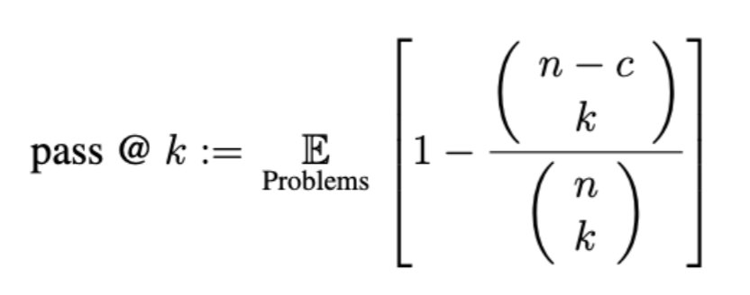
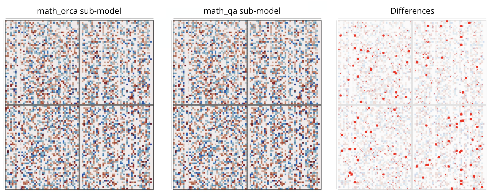
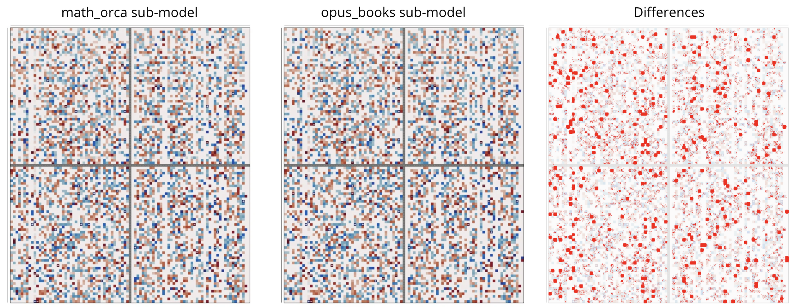
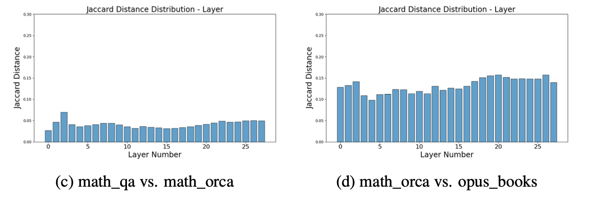

# Building Domain-Specific Sub-Models from Large Language Models using Pruning
Implementation of the following thesis project: Building Domain-Specific Sub-Models from Large Language Models using Pruning. 

--- 

Acknowledging the benefits of Wanda pruning method, which prunes LLMs based on both weights and input actiations:
<p align="center">

</p>
<p align="center"><i>Image sourced from Wanda repository.</i></p>

The goal of this project is to focus on the impact of calibration data in the pruing process. Specifically understanding whether pruning using domain-specific calibration sampels leads to domain-specific sub-models. Or anyway if it has an impact on the performance of these sub-models on specific domains.

## Setup
Installation instructions can be found in [INSTALL.md](INSTALL.md).

## Usage
The datasets used have been doenloaded from [Hugging Face](https://huggingface.co) and are available for free download. To correctly prune your models you should replace the dataset directory with the one where you downloaded the dataset in [data.py](lib/data.py).

Below is an example command for pruning CodeLlama-7B-Instruct with Wanda, to achieve unstructured 50% sparsity, using openbookqa as calibration set.
```sh
python main.py \
    --model codellama/CodeLlama-13b-Instruct-hf \
    --prune_method wanda \
    --sparsity_ratio 0.5 \
    --sparsity_type unstructured \
    --pruning_dataset openbookqa
    --save out/codellama-7B-inst-pruned_openbookqa/unstructured/wanda/ 
```
The following is an overview of the arguments:  
- `--model`: The identifier for the model on the Hugging Face model hub.
- `--cache_dir`: Directory for loading or storing LLM weights.
- `--prune_method`: wanda
- `--sparsity_ratio`: Denotes the percentage of weights to be pruned.
- `--sparsity_type`: Specifies the type of sparsity [`unstructured`, `2:4`, `4:8`].
- `--pruning_dataset`: The dataset to use as calibration set.
- `--save`: Specifies the directory where the result will be stored.

For structured N:M sparsity, set the argument `--sparsity_type` to "2:4" or "4:8".

## Evaluation of sub-models
Each sub-model obtained after pruning has been evaluated on four domains: Code Generation, Commonsense Reasoning, Translation (en-fr) and Math. For each of these domains different metrics and benchmarks have been used.

### Code Generation
The accuracy of sub-models on code generation tasks is assessed using the pass@k metric on two renowned benchmarks: HumanEval and MBPP. The pass@k metric is able to evaluate the functional correctness of the code generated, meaning that a sample of generated code is considered correct if it passes a set of unit tests. At least <i>k</i> code samples are generated per problem (specifically a number <i>n</i>), and, having the number of correct samples <i>c</i> (the ones that pass all the unit tests), the evaluation score is computed as:

<p align="center">
  
</p>

To run the evaluation for <b>HumanEval</b> you should be in the right folder (HumanEval) and run the following command:
```sh
python eval_pal.py \
    --logdir Gemma-Instruct-7b-pruned_apps \
    --language python \
    --dataroot data
```
The following is an overview of the arguments:  
- `--logdir`: The directory where your pruned model's weights are stored.
- `--language`: The programming language on which the evaluation will be performed (e.g., python, java, javascript, etc.).
- `--dataroot`: The folder containing the HumanEval dataset used for evaluation.

To run the evaluation for <b>MBPP</b> you should be in the right folder (Evaluation_MBPP/MBPP) and run the following command:
```sh
python eval_pal.py \
    --logdir Gemma-Instruct-7b-pruned_apps \
    --language python \
    --dataroot data
```
The following is an overview of the arguments:  
- `--logdir`: The directory where your pruned model's weights are stored.
- `--dataroot`: The folder containing the HumanEval dataset used for evaluation.

### Commonsense Reasoning
Commonsense Reasoning focuses on the model’s ability to understand and reason about everyday situations and concepts, assessing the model’s capacity to make logical inferences, predict outcomes, and comprehend implicit knowledge based on common sense. The evaluation is made using zero-shot accuracy. Contrary to few-shot, where the model is given a few demonstrations of the task at inference time, zero-shot evaluation involves giving the model a natural language instruction describing the task, with no demonstrations/examples of desired outcomes.

The framework used for zero-shot accuracy is the same used originally in [Wanda](https://github.com/locuslab/wanda.git), and an explanation of how to use it can be found in their README. The datasets used as benchmark in this case are openbookqa, winogrande, boolq, ARC_Easy, ARC_Challenge, hellaswag.

After having installed the appropriate framweork, the evaluation can be started through the following command:

```sh
python ZS-evaluation.py \
    --dataset apps \
    --eval-zero-shot \
    --csr
```

If the model to be evaluated is a foundational (not-pruned) one, instead of dataset use `--model` and the name of the hugging face model. For pruned models, instead, specify only the pruned dataset, and change the code in `ZS-evaluation.py`, so that the prefix present in the method `get_weight_dir` is the correct one for your sub-model.

### Translation
To effectively evaluate translation performance, METEOR was used as a metric. METEOR offers enhanced accuracy as it incorporates not only precision, the proportion of the matched n-grams out of the total number of n-grams in the evaluated translation, but also recall. Recall, which is the proportion of the matched n-grams out of the total number of n-grams in the reference translation, is extremely important for assessing the quality of the output, as it reflects to what degree the translation covers the entire content of the translated sentence.

To ensure the accuracy computation is as valuable and reliable as possible, for each test sample, the answer is generated by the model five times. METEOR accuracy is then calculated independently for each of these five translations by comparing them to the reference translation of the test. The highest accuracy among these five translations is retained. The datasets used for these tests are wmt14 and opus_books.

To run the evaluation the following command is needed:

```sh
python samples_generation_transl.py \
    --dataset song_translation \
    --eval_dataset wmt14 
```
If the model to be evaluated is a foundational (not-pruned) one, instead of dataset use `--model` and the name of the hugging face model. For pruned models, instead, specify only the pruned dataset, and change the code in `samples_generation_transl.py`, so that the prefix present in the method `get_weight_dir` is the correct one for your sub-model. `eval_dataset.py` represents the dataset used for evaluation, the one containing the reference solutions.

### Math
The evaluation of models on math tasks is made leveraging the “grade-school-math” dataset, known as “GSM8K”. The accuracy is calculated as the 8-shot accuracy, which involves
assessing the model’s performance based on its ability to accurately generate text or make predictions after being exposed to a limited amount of data (8 samples).

To run the evaluation the GSM8K must be downloaded and the following command is needed:

```sh
python math_eval.py \
    --model_name_or_path Gemma-Instruct-7b-pruned_math_qa \
    --data_root gsm8k
```
Where `--model_name_or_path` is the directory where the model's weights are stored and `--data_root` is the directory of the downloaded `gsm8k` dataset.

## Results on Gemma-1.1-7b-it
The following is an example of the results obtained for Gemma's sub-models. The accuracy for each domain is calculated as the average accuracy registered across all the benchamarks used for the specific domain.
<table>
  <tr>
    <th>pruning_dataset</th>
    <th>Code</th>
    <th>CSR</th>
    <th>Translation</th>
    <th>Math</th>
  </tr>
  <tr>
    <td>-</td>
    <td style="text-align: center;">~52.9%</td>
    <td style="text-align: center;">~40.57%</td>
    <td style="text-align: center;">~50.41%</td>
    <td style="text-align: center;">~46.4%</td>
  </tr>
  <tr>
    <td>python_alpaca</td>
    <td style="text-align: center;">~46.99%</td>
    <td style="text-align: center;">~38.23%</td>
    <td style="text-align: center;">~45.75%</td>
    <td style="text-align: center;">~32.44%</td> 
  </tr>
    <tr>
    <td>apps</td>
    <td style="text-align: center;"><b>~47.07%</b></td>
    <td style="text-align: center;">~36.47%</td>
    <td style="text-align: center;">~45.84%</td>
    <td style="text-align: center;">~32.2%</td>
  </tr>
    <tr>
    <td>github_python</td>
    <td style="text-align: center;">~46.47%</td>
    <td style="text-align: center;">~37.34%</td>
    <td style="text-align: center;">~45.23%</td>
    <td style="text-align: center;">~33.6%</td>
  </tr>
    <tr>
    <td>openbookqa</td>
    <td style="text-align: center;">~43.23%</td>
    <td style="text-align: center;"><b>~38.9%</b></td>
    <td style="text-align: center;">~45.63%</td>
    <td style="text-align: center;">~26.9%</td>
  </tr>
    <tr>
    <td>hellaswag</td>
    <td style="text-align: center;">~40.82%</td>
    <td style="text-align: center;">~38.4%</td>
    <td style="text-align: center;">~44.28%</td>
    <td style="text-align: center;">~26.99%</td>
  </tr>
    <tr>
    <td>commonsenseqa</td>
    <td style="text-align: center;">~41.61%</td>
    <td style="text-align: center;">~38.45%</td>
    <td style="text-align: center;">~45.21%</td>
    <td style="text-align: center;">~27.29%</td>
  </tr>
    <tr>
    <td>wmt14</td>
    <td style="text-align: center;">~38.58%</td>
    <td style="text-align: center;">~38.34%</td>
    <td style="text-align: center;">~48.55%</td>
    <td style="text-align: center;">~27.14%</td>
  </tr>
    <tr>
    <td>song_translation</td>
    <td style="text-align: center;">~40.91%</td>
    <td style="text-align: center;">~37.58%</td>
    <td style="text-align: center;">~48.29%</td>
    <td style="text-align: center;">~29.7%</td>
  </tr>
    <tr>
    <td>opus_books</td>
    <td style="text-align: center;">~41%</td>
    <td style="text-align: center;">~39%</td>
    <td style="text-align: center;"><b>~48.6%</b></td>
    <td style="text-align: center;">~26.8%</td>
  </tr>
    <tr>
    <td>math_qa</td>
    <td style="text-align: center;">~44.44%</td>
    <td style="text-align: center;">~37.65%</td>
    <td style="text-align: center;">~45.38%</td>
    <td style="text-align: center;">~35.25%</td>
  </tr>
    <tr>
    <td>math_instruct</td>
    <td style="text-align: center;">~45.26%</td>
    <td style="text-align: center;">~37.95%</td>
    <td style="text-align: center;">~45.15%</td>
    <td style="text-align: center;">~35.10%</td>
  </tr>
    <tr>
    <td>math_orca</td>
    <td style="text-align: center;">~45.05%</td>
    <td style="text-align: center;">~37.39%</td>
    <td style="text-align: center;">~45.6%</td>
    <td style="text-align: center;"><b>~36.16%</b></td>
  </tr>
    <tr>
    <td>c4</td>
    <td style="text-align: center;">~42.2%</td>
    <td style="text-align: center;">~38.1%</td>
    <td style="text-align: center;">~46.74%</td>
    <td style="text-align: center;">~29%</td>
  </tr>
</table>

## Comparison of sub-models' parameter masks
An analysis of the internal structure of the obtained domain-specific sub-models has been conducted to understand whether the way models are pruned affects their specificity to certain domains. To plot the jaccard distance of layers between two sub-models you can use the `Visualization/compute_similarity.py` script, while for the `penzai` representation of the weight matrices of the sub-models the notebook `Visualization/Visualization_llm.ipynb` can be used.

<b>The following is an example of the outcomes that can be derived:</b>

<p align="center">
  
  <br>
  <i>The first two images (left and center) represent the visualization of the weight matrices “q_proj” of layer 12 of two sub-models obtained by pruning Gemma-7B-it respectively with math_orca dataset (left) and math_qa datasets. The last image (right) represents the weights that differ between the two matrices (red dots).</i>
</p>

<p align="center">
  
  <br>
  <i>The first two images (left and center) represent the visualization of the weight matrices “q_proj” of layer 12 of two sub-models obtained by pruning Gemma-7B-it respectively with math_orca dataset (left) and opus_books datasets. The last image (right) represents the weights that differ between the two matrices (red dots).</i>
</p>

<p align="center">
  
  <br>
  <i>Comparison of the pruning masks of different sub-models obtained by pruning Gemma-7B-it with math_qa, math_orca and opus_books.</i>
</p>

From the previous images it is clear that same-domain sub-models tend to have higher similarities in terms of retained weights post-pruning with respect to different-domain ones.

## Inference speedup
The inference speed of the original and pruned models was calculated using CUTLASS to sparsify the weight matrices. A speedup was registered with the pruned models. This speedup was expected as part of the trade-off of pruning: sacrificing accuracy for computational improvements. To reproduce the results this [blog post](https://pytorch.org/tutorials/prototype/semi_structured_sparse.html) can be followed.

### Speedup results

<table>
  <thead>
    <tr>
      <th>Model</th>
      <th>Layer</th>
      <th>Dense</th>
      <th>Sparse</th>
      <th>Speedup</th>
    </tr>
  </thead>
  <tbody>
    <tr>
      <td rowspan="7">CodeLlama-I-13B</td>
      <td>q_proj</td>
      <td>0.449</td>
      <td>0.329</td>
      <td>1.365x</td>
    </tr>
    <tr>
      <td>k_proj</td>
      <td>0.450</td>
      <td>0.330</td>
      <td>1.363x</td>
    </tr>
    <tr>
      <td>v_proj</td>
      <td>0.450</td>
      <td>0.330</td>
      <td>1.361x</td>
    </tr>
    <tr>
      <td>o_proj</td>
      <td>0.450</td>
      <td>0.331</td>
      <td>1.360x</td>
    </tr>
    <tr>
      <td>up_proj</td>
      <td>1.014</td>
      <td>0.998</td>
      <td>1.016x</td>
    </tr>
    <tr>
      <td>gate_proj</td>
      <td>1.010</td>
      <td>1.000</td>
      <td>1.010x</td>
    </tr>
    <tr>
      <td>down_proj</td>
      <td>1.061</td>
      <td>0.881</td>
      <td>1.204x</td>
    </tr>
  </tbody>
</table>

## Acknowledgement
This repository is build upon the [Wanda](https://github.com/locuslab/wanda.git) repository.
